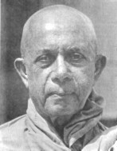

## Tiểu Sử Đại Đức Narada

Đại Đức Narada Maha Thera, người Tích-Lan, lúc thiếu thời theo học trường St Benedicts College, là một trường Thiên Chúa Giáo. Vào năm mười tám tuổi, Ngài xuất gia và nhập chúng dưới sự dẫn dắt của vị Đại Lão Tăng Pelene Vajiranyana. Chính ở dưới chân của vị cao tăng lỗi lạc này mà Đại Đức Narada được đào luyện châu đáo và thấm nhuần Giáo Pháp.

Kế đó, Ngài vào Đại Học Đường Tích Lan và về sau được bổ làm giảng sư về môn Đạo Đức Học và Triết Học tại Đại Học này.

Đại Đức Narada nổi tiếng về kiến thức sâu rộng, nhất là về đạo hạnh và từ bi.

Ngài là tác giả của nhiều quyển sách Phật giáo cô giá trị: Quyển "The Manual of Abhidhamma" (Khái luận về Vi Diệu Pháp) là bản dịch ra Anh văn phần uyên thâm nhất của giáo lý nhà Phật. Quyển "Dhammapada" (Kinh Pháp Cú) cũng được Ngài phiên dịch ra Anh văn và chú giải. Còn quyển "The Buddha and His Teachings" (Đức Phật và Phật Pháp) là một tác phẩm xuất sắc của tác giả. Riêng quyển sau cùng này có thể được xem là sách căn bản cho những ai muốn tìm hiểu Phật giáo.

Đại Đức Narada đã nhiều lần đi vòng quanh thế giới với mục đích hoằng khai Phật Pháp. Ở nhiều nơi, Ngài nói lên tiếng nói trung thực của Giáo Pháp, tức là lời dạy rõ ràng và minh bạch của Đức Phật. Ngài có thể được liệt vào hàng sứ giả tiền phong của đạo Phật, mở đường dọn lối cho những sứ giả khác.

Đại Đức Narada cũng là người sáng lập ra nhiều Trung Tâm và Hiệp Hội Phật Giáo ở Đông cũng như ở Tây Phương.

Ngài là Tăng Trưởng chùa Vajirarama ở Tích Lan (Sri Lanka) và là một Pháp sư nổi tiếng khắp nơi, chí đến trong chốn bình dân.

_**Đại đức Hoà thượng Piyadassi Maha Thera**_

---

## Hòa thượng Narada (1898-1983)

Hòa thượng Narada (Narada Maha Thera) có thế danh là Sumanapala. Ngài sinh vào ngày 17 tháng 7, 1898 tại Kotahena, ngoại ô thành phố Colombo, thủ đô của nước Tích Lan (Sri Lanka). Ngài xuất thân từ một gia đình trung lưu trí thức, và được gửi đi học cấp tiểu học và trung học của nhà dòng La-san đạo Gia-tô. Dù rằng ngài đã được đào tạo trong môi trường đạo Thiên Chúa, ngài lúc nào cũng hâm mộ đạo Phật và học tập Phật Pháp từ một người chú, và ngài học thêm tiếng Sanskrit từ Hòa thượng Palita, tham dự nhiều khóa giáo lý vào các ngày cuối tuần tại chùa Paramananda trong vùng.

Năm 18 tuổi ngài quyết định xuất gia, thọ giới Sa di với pháp danh là Narada, vị thầy bổn sư là Hòa thượng Vajiranana, một vị danh tăng vào thời đó. Thầy truyền giới là Hòa thượng Revata, và thầy truyền pháp là Tỳ kheo Pelene. Sau đó, ngài theo học các khóa Vi Diệu Pháp và Ngữ học Đông phương.

Sa di Narada thọ giới cụ túc (tỳ kheo) vào năm lên 20 tuổi. Ngài được gửi đi học các khóa Đạo đức học và Triết học tại Đại học Tích Lan (Ceylon University College), với nhiều giáo sư danh tiếng như Đại đức Sumangala, Tiến sĩ Chandrasena, và Bác sĩ Pereira (về sau xuất gia, và trở thành Đại đức Kassapa rất nổi tiếng).

Năm 30 tuổi, ngài được cử đi tham dự lễ khánh thành chùa Mulagandhakuti tại Saranath (Xa-nặc), Benares (Ba-na-lại), Ấn Độ, và tham gia các công tác hoằng pháp tại đó. Trong thời gian này, ngài có dịp công tác với ông Jawaharial Nehru mà về sau trở thành vị thủ tướng đầu tiên của Ấn Độ.

Ít lâu sau ngài được cử đi truyền giáo tại Trung Quốc và các nước Đông Nam Á: Cam Bốt, Lào, Việt Nam, Nam Dương, Mã Lai. Tại những nơi này, ngài thường được tiếp đón rất nồng hậu. Quốc vương Cam Bốt tôn vinh ngài là Đức Đại Tôn Giả (Sri Maha Sadhu).

Ngoài ra ngài còn có nhiều chuyến đi truyền đạo tại các nước Tây phương. Năm 1955, ngài sang Úc, và giúp tổ chức các hội Phật Giáo địa phương tại các bang New South Wales, Victoria, Tasmania và Queensland. Năm 1956, ngài du hành sang Anh quốc, tổ chức cử hành lễ Tưởng Niệm 2.500 năm sau ngày Đại Bát Niết Bàn của Đức Phật. Sau đó ngài giúp củng cố Phật sự và xây dựng ngôi chùa danh tiếng mang tên Chùa Phật Giáo Luân Đôn (London Buddhist Vihara). Ngài sang Hoa Kỳ hoằng pháp, và được cung thỉnh thuyết giảng về đề tài "Đức Phật và Triết lý đạo Phật" tại đài kỷ niệm Washington (Washington Memorial) trước một cử tọa rất đông đảo. Ngài là một sứ giả Như Lai rất hăng hái và nhiệt tình, thu hút được nhiều người nghe, và lúc nào cũng khuyến khích thành lập các hội Phật Giáo địa phương để bồi đắp công trình hoằng dương đạo pháp.

Ngài có nhiều gắn bó với đất nước và Phật tử Việt Nam. Ngài đã từng đến Việt Nam vào đầu thập niên 1930, mang theo nhiều nhánh cây bồ đề để trồng tại nhiều nơi trong nước: Phú Lâm (Chợ Lớn), Cần Thơ, Châu Đốc, Vĩnh Long ở miền Tây Nam bộ, Biên Hòa, Phước Tuy, Vũng Tàu ở miền Đông Nam bộ, ra đến miền Trung (Đà Lạt, Huế) và miền Bắc (Vinh, Hà Nội). Trong thập niên 1950, khi Giáo hội Tăng già Nguyên thủy Việt Nam được thành lập, ngài đến Việt Nam nhiều lần để thuyết pháp, hằng tuần tại chùa Kỳ Viên (Quận Ba, Sài Gòn) thu hút đông đảo Phật tử đến nghe, và có rất nhiều người đến xin quy y với ngài. Đặc biệt là vào năm 1963, ngài đã khuyến khích ủng hộ công tác xây cất bảo tháp Thích Ca Phật Đài tại Vũng Tàu, ngày nay được xem như là một di tích lịch sử. Ngoài ra, ngài còn giúp xây dựng một bảo tháp khác ở Vĩnh Long.

Ngoài các thời thuyết pháp và công tác tổ chức Phật sự, ngài còn hướng dẫn các lớp Vi Diệu Pháp và các khóa hành thiền, khuyến khích việc phiên dịch các sách Phật Pháp sang Việt ngữ để truyền bá rộng rãi. Các tập sách nhỏ sau đây đã được chuyển dịch:

- Hạnh Phúc Gia Đình (Parents and Children),
- Phật Giáo - Di Sản Tinh Thần của Dân Tộc Việt Nam (Buddhism - Heritage of Vietnam),
- Phật Giáo Tóm Lược (Buddhism in a Nutshell),
- Tứ Vô Lượng Tâm (Brahma Vihara),
- Những Vấn Đề của Kiếp Nhân Sinh (The Problems of Life),
- Những Bước Thăng Trầm (The Eight Worldly Conditions),
- Kinh Niệm Xứ (Satipatthana Sutta),
- Kinh Pháp Cú (The Dhammapada)
- Vi Diệu Pháp Toát Yếu (The Manual of Abhidhamma)
- v.v.

Đặc biệt nhất là quyển "**Đức Phật và Phật Pháp**" (The Buddha and His Teachings) đã được xuất bản tại Sài Gòn bằng hai thứ tiếng: Anh và Việt. Bản Việt ngữ do ông Phạm Kim Khánh chuyển dịch, với 4.000 quyển đầu tiên được in ra vào năm 1970, và sau đó một năm, lại được tái bản thêm 4.000 quyển. Từ đó đến nay, quyển này đã được in lại rất nhiều lần, trong nước cũng như tại hải ngoại, và đã được xem như là một trong những tài liệu căn bản quan trọng trong các khóa Phật học. Gần đây (1998), ông Khánh đã hiệu đính lại bản dịch đó, dựa theo ấn bản Anh ngữ cuối cùng trước khi ngài viên tịch.

Ngài viên tịch vào ngày Chủ Nhật 2 tháng 10, 1983, hưởng thọ 85 tuổi, tại chùa Vajirarama nơi ngài làm Tăng trưởng Chưởng quản trong những năm cuối của đời ngài. Tang lễ được chính phủ và Phật tử Tích Lan cử hành trọng thể như là một quốc táng.

Ông Phạm Kim Khánh viết: "...Phần đóng góp của ngài vào công trình hoằng dương giáo pháp thật mênh mông rộng lớn. Ngài là một vị cao tăng nổi tiếng là một nhà truyền giáo lỗi lạc, một giảng sư có tài diễn giải những điểm thâm sâu của Phật Giáo một cách giản dị và rõ ràng. Ngài làm việc không biết mệt để rải khắp mọi nơi bức thông điệp hòa bình đượm nhuần từ bi và trí tuệ của Đức Bổn Sư. Ngài cũng là tác giả của nhiều quyển sách Phật Giáo đã được truyền bá rộng rãi khắp thế giới." Và ông Premadasa, thủ tướng Tích Lan năm 1979, kết luận: "...Ngài đã dành trọn cuộc đời mình -- qua một cách vị tha bất cầu lợi -- để phụng sự cho hòa bình trên thế giới và đem lại hạnh phúc an lành cho nhân loại."

**_Bình Anson  
Perth, Western Australia,  
tháng 07-2000_**
