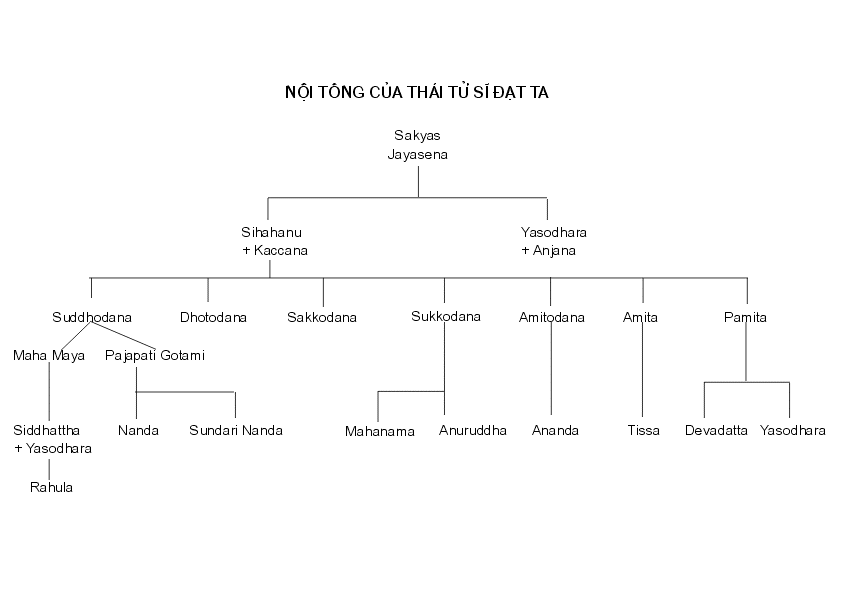
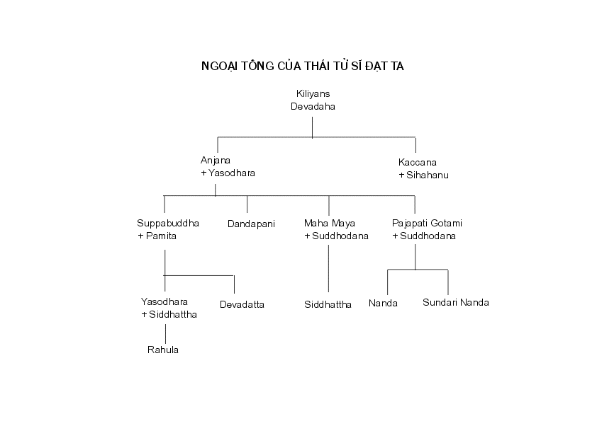

## Từ Đản Sanh đến Xuất Gia

> _Một Chúng Sanh duy nhất, một Con Người phi thường, xuất hiện trong thế gian này, vì lợi ích cho phần đông, vì hạnh phúc của phần đông, vì lòng bi mẫn, vì sự tốt đẹp, vì lợi ích và hạnh phúc của chư Thiên và nhân loại._
> - Tăng Nhứt A Hàm[^1]

**Đản Sanh**

Nhằm ngày trăng tròn tháng năm[^2], năm 623[^3] trước D.L., trong vườn Lumbini[^4] (Lâm Tỳ Ni) tại Kapilavatthu (Ca Tỳ La Vệ)[^5] bên ranh giới Ấn Độ của xứ Nepal ngày nay, có hạ sanh một hoàng tử mà về sau trở thành vị giáo chủ vĩ đại nhất trên thế gian.

Cha hoàng tử là Đức Vua Suddhodana[^6] (Tịnh Phạn) thuộc quý tộc Sakya (Thích Ca)[^7] và mẹ là Hoàng Hậu Maha Maya (Ma Da). Sau khi hạ sanh hoàng tử được bảy ngày thì hoàng hậu thăng hà. Em bà là Maha Pajapati Gotami, cũng cùng kết duyên với Vua Tịnh Phạn, thay thế bà để dưỡng dục hoàng tử và gởi con là Nanda cho một bà vú nuôi chăm sóc.

Khi tin lành hoàng tử chào đời được loan truyền trong dân gian, tất cả thần dân trong vương quốc đều vui mừng không xiết kể.

Thuở ấy có một đạo sĩ tên Asita (A Tư Đà), cũng được gọi là Kaladevala đặc biệt hoan hỷ. Ông là một người thân tín của nhà vua nên xin được vào thăm hoàng tử. Đức Vua Tịnh Phạn lấy làm hân hoan, cho bồng hoàng tử ra đảnh lễ đạo sĩ. Nhưng, trước sự kinh ngạc của mọi người, hoàng tử bỗng nhiên quay về phía đạo sĩ và đặt hai chân lên đầu tóc của ông.

Đang ngồi trên ghế, vị đạo sĩ vội vã chỗi dậy, chắp tay xá chào hoàng tử[^8]. Ông tiên tri rằng về sau hoàng tử sẽ trở nên bậc vĩ nhân cao quý nhất của nhân loại. Đức vua cũng làm theo đạo sĩ, xá chào hoàng tử.

Xong rồi đạo si thoạt tiên cười khan, cười rồi lại khóc. Mọi người đều ngạc nhiên trước những cảm xúc vui buồn lẫn lộn của ông. Vị đạo sĩ giải thích rằng ông cười vì lấy làm hoan hỷ được biết rằng về sau hoàng tử sẽ đắc Quả Phật, và ông khóc vì biết rằng không bao lâu nữa ông sẽ chết và tái sanh vào cảnh giới Vô Sắc (Arupa-loka)[^9]. Do đó ông sẽ không được phước lành thọ giáo với bậc trí tuệ cao minh, Chánh Đẳng Chánh Giác.

**Lễ Quáng Đính (đặt tên)**

Khi hoàng tử được năm ngày, Đức Vua Tịnh Phạn đặt tên là Siddhattha (Sĩ Đạt Ta) có nghĩa là người được toại nguyện. Gotama (Cồ Đàm) là họ Ngài[^10]. Theo phong tục thời bấy giờ, vua cho thỉnh nhiều vị đạo sĩ Bà La Môn học rộng tài cao vào triều nội để dự lễ đặt tên cho hoàng tử. Trong các đạo sĩ, có tám vị đặc biệt lỗi lạc. Sau khi quan sát đặc tướng của hoàng tử, bảy vị đưa lên hai ngón tay và giải thích rằng có hai lẽ. Một, là hoàng tử sẽ trở nên vị hoàng đế vĩ đại nhất thế gian. Hai, là Ngài sẽ đắc Quả Phật. Nhưng vị đạo sĩ trẻ tuổi và thông minh nhất trong tám vị, tên Kondanna[^11] (Kiều Trần Như), chỉ đưa lên một ngón quả quyết rằng ngày kia hoàng tử sẽ hoàn toàn thoát tục và đắc Đạo Quả Phật.

**Lễ Hạ Điền**

Một sự kiện lạ lùng đã xảy ra trong thời thơ ấu của Hoàng Tử Siddhattha (Sĩ Đạt Ta). Sự kiện ấy là một kinh nghiệm tinh thần sẽ giúp hoàng tử thật nhiều sau này, khi Ngài quyết tâm tìm chân lý. Sự kiện ấy cũng là cái chìa khoá mở đường cho Ngài tiến đến Giác Ngộ[^12].

Lúc bấy giờ, để khuyến khích nông dân, Vua Tịnh Phạn ra lệnh tổ chức một cuộc lễ gọi là Hạ Điền. Đây quả thật là một cơ hội cho tất cả, giàu như nghèo, sang như hèn, ăn mặc tốt đẹp để vui chơi hỷ hạ một bữa, trước khi bắt tay vào công việc ruộng nương đồng áng. Sáng ngày, đức vua cùng quần thần, áo mặc chỉnh tề, ra tận nơi hành lễ. Hoàng Tử Siddhattha (Sĩ Đạt Ta) cũng được cung phi mỹ nữ đặt trong một cái kiệu, màn che sáo phủ, khiêng ra để dưới bóng mát một cội trâm. Hôm ấy đức vua chủ tọa một buổi lễ. Thấy mọi người vui vẻ theo dõi cuộc vui, các cung phi có phận sự trông nom hoàng tử cũng lén chạy đi xem. Trái hẳn với cảnh nhộn nhịp tưng bừng của buổi lễ, tàng bóng mát mẻ dưới cội trâm và khung cảnh êm đềm như mời mọc tĩnh lặng quán niệm. Hoàng tử tuổi tuy còn nhỏ nhưng tâm trí đã thuần thục.

Khác với những người chỉ biết tìm thích thú trong cuộc lễ, hoàng tử nối tréo hai chân lại theo lối kiết già, trầm ngâm lặng lẽ, chăm chú vào hơi thở-vào, thở-ra, gom tâm an trụ, định, và đắc Sơ Thiền[^13].

Giữa lúc mọi người vui vẻ thưởng thức, các cung phi bỗng sực nhớ lại hoàng tử, vội vã trở về với phận sự. Khi thấy hoàng tử ngồi trầm ngâm hành thiền thì họ lấy làm ngạc nhiên, đến tâu lại tự sự cho vua. Đức Vua Suddhodana (Tịnh Phạn) hối hả đến nơi, thấy Hoàng Tử Siddhattha vẫn ngồi tham thiền. Đức vua đến trước mặt hoàng tử, xá chào con và nói: "Hỡi này con yêu quý, đây là lần thứ nhì, phụ vương đảnh lễ con".

**Giáo Dục**

Mặc dầu kinh sách không chép rõ, Hoàng Tử Siddhattha (Sĩ Đạt Ta) chắc chắn đã hấp thụ một nền giáo dục vững chắc vì Ngài là hoàng tử của một quốc gia giàu mạnh. Ngài cũng thuộc dòng chiến sĩ nên chắc chắn phải lão thông binh pháp và võ nghệ cao cường.

**Kết Hôn**

Khi lên mười sáu, theo phong tục thời bấy giờ, hoàng tử kết duyên cùng Công Chúa Yasodhara (Da Du Đà la)[^14], một người em cô cậu, cũng cùng tuổi với Ngài. Trong mười ba năm sau ngày hôn lễ, Ngài sống hoàn toàn cuộc đời vương giả, không hay biết chi đến nỗi thống khổ của nhân loại bên ngoài ngưỡng cửa cung điện.

Về cuộc đời nhung lụa ấy, khi còn là hoàng tử, đã có lần Ngài nói:

"Đời sống của ta thật là tế nhị, vô cùng tinh vi. Trong hoàng cung, chỗ ta ở, phụ hoàng có đào ao, xây những đầm sen. Khi sen xanh đua nhau khoe màu ở đây thì sen đỏ vươn mình phô sắc phía bên kia, và trong đầm bên cạnh, sen trắng đua nhau tranh đẹp dưới ánh nắng ban mai. Trầm hương của ta dùng đều là loại thượng hảo hạng từ xứ Kasi đưa về. Khăn và xiêm áo của ta cũng may toàn bằng hàng lụa bậc nhất từ Kasi[^15] chở đến.

Ngày cũng như đêm, mỗi khi ta bước chân ra khỏi cung điện là có tàng lọng che sương đỡ nắng.

Phụ hoàng cũng kiến tạo riêng cho ta ba tòa cung điện. Một, để cho ta ở mùa lạnh, một, mùa nóng và một, mùa mưa. Trong suốt bốn tháng mưa ta lưu ngụ tại một biệt điện có đầy đủ tiện nghi, giữa những cung tần phi nữ. Cho đến hàng nô tỳ của phụ hoàng cũng được ăn sung mặc sướng chớ không phải như ở các nhà khác, gia đình chỉ được ăn cơm xấu và thức ăn cũ.[^16]"

Thời gian trôi qua, Thái Tử Siddhattha (Sĩ Đạt Ta) càng trưởng thành, ánh sáng chân lý càng rọi rõ sự vật cho Ngài.

Bẩm tánh trầm tư mặc tưởng và lòng từ bi vô lượng vô biên của Ngài không để yên cho Ngài một mình an hưởng những lạc thú tạm bợ của đời vương giả. Riêng mình được yên vui hạnh phúc, nhưng Ngài hằng nghĩ đến thực chất của đời sống và biết rằng nhân loại đang đau khổ bên ngoài cung điện, nên Ngài luôn luôn thương xót.

Sống trong nhung lụa mà Ngài nhận định được rằng đời là đau khổ.

**Xuất Gia**

Thái Tử Siddhattha (Sĩ Đạt Ta) suy niệm như sau:

"Chính ta phải chịu cảnh sanh, già, bệnh, chết, phiền não và ô nhiễm. Tại sao vẫn còn mải mê chạy theo tìm những điều mà bản chất cũng còn như vậy. Vì chịu sanh, lão, bệnh, tử, phiền não và ô nhiễm, ta đã nhận thức sự bất lợi của những điều ấy. Hay ta thử tìm cái chưa được thành đạt, trạng thái tối thượng và tuyệt đối châu toàn: Niết Bàn![^17]"

"Cuộc sống tại gia rất tù túng chật hẹp, là chỗ ẩn náu của bụi trần ô trược, nhưng đời của bậc xuất gia là cảnh trời mênh mông bát ngát! Người đã quen với nếp sống gia đình ắt thấy khó mà chịu đựng Đời Sống Đạo Hạnh Thiêng Liêng, với tất cả sự hoàn hảo và trong sạch của nó.[^18]"

Một ngày vẻ vang kia, thái tử ra khỏi hoàng cung để nhìn xem thế gian bên ngoài và trực tiếp tiếp xúc với sự thật phũ phàng của đời sống. Trong phạm vi nhỏ hẹp của cung điện, Ngài chỉ thấy phần tươi đẹp, nhưng đám đông nhân loại thì biết bề đen tối, đáng ghê sợ của đời. Chính cặp mắt quan sát của thái tử đã nhận thấy một cụ già chân mỏi gối dùn, một người bệnh hoạn đau khổ, một thây ma hôi thúi và một đạo sĩ nghiêm trang khả kính[^19]. Ba cảnh già, bệnh và chết, hùng hồn xác nhận quan điểm của thái tử về đời sống đau khổ của nhân loại. Hình ảnh thong dong từ tốn của nhà tu sĩ thoáng cho Ngài hé thấy con đường giải thoát, con đường an vui hạnh phúc thật sự. bốn quang cảnh bất ngờ ấy càng thúc giục thái tử ghê tởm và sớm thoát ly thế tục.

Nhận định rõ ràng rằng những thú vui vật chất mà phần đông tranh nhau tìm kiếm đều không thể đem lại lợi ích, chỉ có sự xuất gia, sự từ bỏ tất cả mùi danh bã lợi của trần gian này mới thật là chân giá trị, Thái Tử Siddhattha nhất định rời bỏ cung điện đền đài để ra đi, tìm chân lý và An Dưỡng Trường Cửu.

Giữa lúc ấy thì có tin đưa đến rằng Công Chúa Yasodhara (Da Du Đà La), vợ Ngài, vừa hạ sanh hoàng nam.

Đối với thế gian, đó là một tin lành. Nhưng, trái hẳn với mọi dự đoán, Ngài không quá đỗi vui mừng vì thấy đó là thêm trở ngại. Thế thường, khi sanh được người con đầu lòng, cha mẹ cảm nghe trong lòng chớm nở lần đầu tiên một tình thương mặn nồng sâu sắc, một tình thương mới mẻ đậm đà, vô cùng trong sạch. Nỗi vui mừng của người làm cha đầu tiên thật không sao tả được. Nhưng Thái Tử Siddhattha không phải là một người cha thường, Ngài than: "Lại thêm một trở ngại, lại thêm một dây trói buộc". Do đó, Đức Vua Suddhodana (Tịnh Phạn) đặt tên cháu nội là Rahula (La Hầu La)[^20].

Đời vương giả không còn thích hợp với vị Phật tương lai nữa. Đối với một tâm hồn trầm tư mặc tưởng như Thái Tử Siddhattha (Sĩ Đạt Ta), cung điện nguy nga không còn là nơi thích đáng. Cả đến người vợ trẻ đẹp và người con sơ sinh dễ mến cũng không làm sờn ý chí quyết định từ bỏ thế gian. Ngài ra đi với nguyện vọng góp một phần vô cùng quan trọng và hữu ích hơn là phận sự của một người chồng, người cha, hay chí đến nhiệm vụ làm chúa tể các vì vua đi nữa. Cung vàngđiện ngọc không còn sức quyến rũ. Ngài không tìm thấy thích thú trong đời sống vương giả. Giờ ra đi đã điểm.

Ngài truyền lệnh cho Channa (Xa Nặc), người đánh xe yêu chuộng, thắng yên ngựa Kanthaka (Kiền Trắc) và thẳng đến điện của công chúa. Ngài khẽ hé cửa nhìn vợ và con đang yên giấc với một tấm lòng từ ái nhưng bình thản, không chao động, không trìu mến. Tình thương đối với vợ, con thật mặn nồng sâu sắc. Nhưng đối với nhân loại trầm luân đau khổ, lòng trắc ẩn của Ngài lại càng thâm thậm vô ngần. Ra đi, Ngài không lo sợ cho tương lai của công chúa và hoàng tử, vì biết chắc chắn rằng vợ và con sẽ có đầy đủ tiện nghi và đảm bảo để sống an toàn và sung sướng. Ra đi, không phải vì kém tình thương vợ, thương con, mà vì tình thương của Ngài mở rộng cho mọi người, bao trùm tất cả nhân loại và chúng sanh.

Với một tâm hồn thanh thoát, Thái Tử Siddhattha (Sĩ Đạt Ta) ra đi giữa đêm khuya, để lại sau lưng tất cả đền đài cung điện, người cha yêu quý, vợ đẹp, con thơ, và cả một tương lai huy hoàng rực rỡ. Ngài trốn ra khỏi thành và giục ngựa thẳng xông trong đêm tối. Cùng đi với Ngài chỉ có Channa (Xa Nặc), người đánh xe trung thành. Không tiền của, không cửa nhà, nay đây mai đó, Ngài bắt đầu lần bước trên đường đi tìm Chân Lý và An Tĩnh. Thế là Ngài từ bỏ thế gian.

Đây không phải là sự từ bỏ của một cụ già đã trải qua hầu hết cuộc đời của mình, hay của người bần cùng nghèo đói không còn gì để bỏ lại phía sau, nhưng là sự khước từ của một hoàng tử vinh quang giữa thời niên thiếu, trong cảnh ấm no, sung túc và thạnh vượng. Một sự thoát ly chưa từng có trong lịch sử.

Lúc ấy thái tử Siddhattha (Sĩ Đạt Ta) được 29 tuổi.

Đến sáng hôm sau Ngài đi đã xa. Sau khi Ngài vượt qua sông Anoma, Ngài dừng bước trên bãi cát, tự cạo râu tóc và trao xiêm y lại cho Channa (Xa Nặc) đem về. Rồi khoác lên mình tấm y vàng, Hoàng tử Siddhattha (Sĩ Đạt Ta) tự nguyện sống đời tu sĩ và sẵn sàng chấp nhận mọi thiếu thốn vật chất.

Từ một hoàng tử giàu sang vinh hiển tột bậc, Ngài trở thành đạo sĩ nghèo nàn, không tiền của, không cửa nhà, sống nhờ lòng từ thiện của bá tánh thập phương.

Ngài không ở nơi nào thường trực. Một cây cao bóng mát, hoặc một hang đá vắng vẻ hoang vu nào cũng có thể che mưa đỡ nắng cho Ngài. Chân không giày dép, đầu không mũ nón, Ngài đi trong ánh nắng nóng bức và trong sương gió lạnh lùng. Tất cả xiêm y từ tốn chỉ là những mảnh vải vụn vằn ráp lại, vừa đủ để che thân. Tất cả tài sản chỉ là một bình bát để trì bình khất thực. Vật thực và bộ y chỉ vừa đủ để sống.

Ngài tận dụng thì giờ và năng lực trong việc khám phá chân lý.

**Tìm Chân Lý**

Như người thênh thang bất định, Ngài đi tìm cái chi tốt đẹp, trạng thái tuyệt đối vắng lặng. Ngài đến vị đạo sĩ rất lỗi lạc, Alarama Kalama, và nói :

"Này hỡi Đạo Hữu, xin Đạo Hữu cho tôi thọ giáo và sống đời đạo hạnh thiêng liêng dưới sự hướng dẫn của Đạo Hữu."

Alarama Kalama trả lời: "Hãy ở lại đây với tôi, hỡi người đáng kính, đường lối dạy dỗ ở đây là giúp cho người thông minh sớm thấu triệt tất cả giáo lý của vị đạo sư bằng trí tuệ trực giác, và sống ẩn náu trong sự thành đạt ấy."

Không bao lâu sau, Đạo Sĩ Gotama (Cồ Đàm) đã học hết giáo lý của thầy, nhưng không chứng ngộ được chân lý cao thượng hằng mong mỏi.

Tư tưởng sau đây phát sanh đến Ngài :

"Khi Alarama Kalama tuyên bố: 'Ta đã chứng ngộ giáo lý ấy bằng trí tuệ trực giác. Ta đã sống ẩn náu trong sự thành đạt ấy', thì ắt đó không phải chỉ là một lời phát biểu suông của ông. Chắc chắn Alarama Kalama đã thấu triệt, nhận chân giáo lý này và đã sống trong ấy."

Rồi Ngài đến gặp Kalama và nói :

"Này Đạo Hữu Kalama, giáo lý mà chính Đạo Hữu đã chứng ngộ bằng trí tuệ trực giác sâu rộng đến mức nào?"

Alarama liền giải thích rằng đó là cảnh giới Vô Sở Hữu Xứ Thiên (Akincannayatana)[^21], cảnh giới có quan niệm về hư không, một tầng Thiền (Jhana) khá cao.

Và ý tưởng sau đây phát sanh đến Ngài :

"Không phải chỉ có một mình Alarama Kalama mới có hạnh tinh tấn, niệm, định và tuệ. Ta cũng có những đức tánh ấy. Hay là ta hãy cố gắng chứng ngộ giáo lý mà Kalama nói rằng chính ông ta đã chứng ngộ và ẩn náu trong sự thành đạt ấy."

Và sau đó không bao lâu, chính Đạo Sĩ Gotama (Cồ Đàm) cũng chứng ngộ và thành đạt trạng thái ấy đó trí tuệ và trực giác.

Nhưng giáo lý này không giúp Ngài thấu triệt chân lý tối thượng.

Và Ngài đến gần Alarama và nói :

\- Này Đạo Hữu Kalama, có phải đây là mức tận cùng của giáo lý mà Đạo Hữu nói rằng Đạo Hữu đã chứng ngộ bằng trí tuệ trực giác và sống ẩn náu trong sự thành đạt ấy chăng?

\- Đúng vậy, đây chính là giáo lý mà tôi nói rằng tôi đã chứng ngộ và ẩn náu trong sự thành đạt ấy. Đây là mức sâu rộng tận cùng của chân lý.

\- Nhưng, hỡi Đạo Hữu, tôi cũng đã chứng ngộ đến mức này và ẩn náu trong sự thành đạt ấy.

Vị đạo sư không có lòng ganh tỵ, lấy làm hoan hỉ thấy đệ tử lỗi lạc của mình thành công mau chóng, đặt Đạo Sĩ Gotama lên ngang hàng với mình cùng chung hưởng tất cả vinh dự, và nói:

"Hỡi này Đạo Hữu, tôi rất lấy làm hoan hỷ. Thật vậy, tôi thật vô cùng hoan hỷ được gặp một người đồng tu đáng kính như Đạo Hữu. Giáo lý mà tôi đã chứng ngộ bằng tuệ giác và đã tuyên bố thành đạt. Đạo Hữu cũng chứng ngộ bằng tuệ giác và ẩn náu trong sự thành đạt ấy. Giáo lý mà Đạo Hữu chứng ngộ bằng tuệ giác và ẩn náu trong sự thành đạt ấy, chính tôi cũng đã chứng ngộ bằng tuệ giác và đã tuyên bố thành đạt. Như vậy, giáo lý mà tôi đã biết, Đạo Hữu cũng biết. Và giáo lý mà Đạo Hữu biết, tôi cũng đã biết. Tôi như thế nào thì Đạo Hữu cũng như thế ấy. Vậy, hãy đến đây, Đạo Hữu, chúng ta hãy cùng nhau hợp sức dẫn dắt nhóm đạo sĩ này."

Đạo Sĩ Gotama (Cồ Đàm) không thỏa mãn với một kỷ luật và giáo lý chỉ đưa đến tầng khá cao của tâm định mà không dẫn đến "trạng thái ghê tởm, buông xả (không luyến ái), chấm dứt (mọi đau khổ), tình trạng tĩnh lặng, trực giác, giác ngộ và Niết Bàn". Nguyện vọng của Ngài cũng không phải là dẫn dắt một nhóm đạo sĩ, dầu là hợp sức với một đạo sư quảng đại khoan hồng cũng đã thành đạt mức tiến bộ tinh thần như Ngài. Trước tiên, tự Ngài chưa làm cho mình được toàn thiện và cảm nghĩ rằng như vậy không khác nào người mù dẫn dắt người mù. Chưa được toại nguyện, Ngài từ giã Alarama Kalama ra đi.

Vào những ngày thanh bình an lạc thuở bấy giờ, trong xứ không bị hoàn cảnh chánh trị làm xáo trộn, hàng trí thức xứ Ấn Độ chỉ lo nghiên cứu học hỏi và truyền bá hệ thống tôn giáo của mình. Xã hội cung ứng mọi dễ dàng những nơi vắng vẻ ẩn dật cho người có khuynh hướng trở về với đời sống đạo đức. Phần lớn các vị này có một số đông đệ tử, và Đạo Sĩ Gotama không gặp nhiều khó khăn trong việc tìm đạo sư.

Ngài đến thọ giáo với một vị đạo sư trứ danh khác tên Uddaka Ramaputta. Không bao lâu, vị đệ tử thông minh xuất chúng Gotama đã thấu triệt giáo lý của thầy và chứng đắc đệ bát thiền Vô Sắc tức là tầng cao nhất của thiền Vô Sắc Giới: cảnh giới Phi Tưởng Phi Phi Tưởng, không còn tri giác (sanna, tưởng), mà cũng không có không-tri-giác (N'eva sanna N'asannayatana)[^22],ấy là tầng thiền cao nhất trong tam giới. Khi đắc được Thiền này, tâm trở nên vô cùng tinh vi tế nhị đến nỗi không thể nói là có tâm hay không. Vào thời bấy giờ không có ai đắc được thiền nào cao hơn nữa.

Vị đạo sư cao thượng lấy làm hoan hỷ được biết sự thành công rực rỡ của người đệ tử hoàng phái đặc sắc của mình. nhưng không như vị đạo sư trước, đạo sĩ Uddaka Ramaputta mời Ngài nhận lãnh trọn vẹn trách nhiệm dạy dỗ hàng môn đệ:

"Hỡi này Đạo Hữu, tôi lấy làm hoan hỷ. Thật vậy, tôi vô cùng hoan hỷ được gặp một người bạn đồng tu tài đức đáng tôn kính như Đạo Hữu. Giáo lý mà Rama đã hiểu biết, Đạo Hữu cũng hiểu. Giáo lý mà Đạo Hữu hiểu, Rama cũng đã hiểu biết. Rama đã như thế nào thì hôm nay Đạo Hữu cũng như thế ấy. Ngày nay Đạo Hữu như thế nào thì Rama đã như thế ấy. Vậy, hỡi này Đạo Hữu, hãy ở lại đây, Đạo Hữu sẽ dẫn dắt nhóm đạo sĩ này".

Tuy nhiên Đạo Sĩ Gotama cảm thấy rằng đó cũng chưa phải là mục tiêu cứu cánh. Ngài đã hoàn toàn chế ngự, làm chủ tâm mình, nhưng mục tiêu cuối cùng vẫn còn ở mãi xa. Ngài đang tìm con đường Niết Bàn tức là tuyệt đối siêu thoát ra khỏi vòng phiền não trầm luân và tận diệt mọi hình thức ái dục. Không thỏa mãn với phương pháp tu tập của Ramaputta, Ngài lại ra đi.

Ngài nhận thấy rằng không ai có đủ khả năng để dẫn dắt mình thành tựu mục tiêu vì tất cả đều chưa thoát ra khỏi vòng vô minh. Từ đó Ngài không tìm sự giúp đỡ từ bên ngoài nữa.

Chân lý và sự vắng lặng chỉ tìm được ở bên trong chúng ta.

_**Chú thích:**_

[^1]: Anguttara Nikaya, Tăng Nhứt A Hàm, phần I, XIII, trang 22

[^2]: Trùng với tháng Vesakha (Pali), hay Vaisakha (Sanskrit). Tiếng Sinhala là Vesak.

[^3]: Không giống như kỷ nguyên Thiên Chúa, Phật Lịch khởi đầu ngày Đức Phật Nhập Đại Niết Bàn (viên tịch), vào năm 543 trước Dương Lịch, chớ không phải ngày Bồ Tát đản sanh.

[^4]: Một thạch trụ do Vua Asoka (A Dục) dựng lên nơi đây vẫn còn.

[^5]: Địa điểm của Kapilavatthu được nhận ra là Bhuila (Bhulya) trong quận Basti cách Bengal 3 cây số và nằm vào hướng Tây Bắc nhà ga xe lửa Babuan.

[^6]: Bảng gia phả: 

[^7]: Gotama (Cồ Đàm) là họ, và Sakya (Thích Ca) là tên chủng tộc của Đức Phật. Tục truyền rằng do âm mưu bất chính của bà mẹ ghẻ, những người con của Vua Okkaka Mahasammata bị lưu đày. Trong cuộc đi bất định ấy, các hoàng tử đến chân núi Himalaya (Hy Mã Lạp Sơn) và tại đây, gặp nhà hiền triết Kapila. Do lời khuyên của vị này, các hoàng tử sáng lập thành Kapilavatthu (Ca Tỳ La Vệ), có nghĩa là nơi chốn của Kapila. Khi nghe được công trình của các con, Vua Okkaka thốt lên rằng: "Sakya vata bho rajakumara" - Các hoàng tử cao quý này quả thật có khả năng. Từ đó dòng dõi và vương quốc mà các hoàng tử sáng lập lấy tên là Sakya (Thích Ca). Vương quốc của dòng Thích Ca nằm vào phía Nam xứ Nepal và mở rộng hơn xứ Oudh ngày nay nhiều. (Xem E.J. Thomas, Life of Buddha, trang 6)

[^8]: Xem quyển Buddhims in Translation, tác giả Waren, trang 49, Chú Giải Túc Sanh Truyện. Người cháu của đạo sĩ Asita là Nalaka, xuất gia theo lời khuyên của đạo sĩ, và khi hoàng tử đắc Quả Phật, Nalaka đến nghe Ngài thuyết giảng và đắc Quả A La Hán. (Xem Nalaka Sutta, Sutta Nipata, trang 131).

[^9]: Arupa-lokas là những cảnh giới Vô Sắc mà người đắc những tầng Thiền Vô Sắc (Arupa Jhana) sẽ tái sanh vào.

[^10]: Sanskrit là Siddharta Gautama.

[^11]: Về sau, khi nghe tin Thái Tử Siddhattha (Sĩ Đạt Ta) thoát ly thế tục, chính vị đạo sĩ Kondanna (Kiều Trần Như) này cũng ra đi, cùng với bốn người con của những vị trong bảy vị Bà La Môn khác, theo thọ giáo với Đạo Sĩ Gotama. Xem Chương 6.

[^12]: Xem Majjhima Nikaya, Trung A Hàm, Maha Saccaka Sutta, số 36.

[^13]: Sơ Thiền, tầng Thiền (Jhana) thứ nhất, là một trạng thái tâm phát triển khá cao, nhờ an trụ vững chắc.

[^14]: Công Chúa Yasodhara cũng được gọi là Bhaddakaccana, Bimba Rahulamata.

[^15]: Kasi là một tỉnh ở miền Trung Ấn Độ nổi tiếng có nhiều loại hàng lụa tốt. Tỉnh lỵ của Kasi là Benares ngày nay.

[^16]: Anguttara Nikaya (Tăng Nhứt A Hàm), phần 1, trang 145\. Gradual Sayings, phần 1, trang 128.

[^17]: Majjhima Nikaya (Trung A Hàm), Phần 1, Ariyapariyesana Sutta, số 26, trang 163.

[^18]: Majjhima Nikaya (Trung A Hàm), Phần 1, Mahasaccaka Sutta, số 36.

[^19]: "Thấy bốn cảnh tượng, ta lên ngựa ra đi..." Buddhavamsa, XXVI, trang 65.

[^20]: Rahula, có nghĩa bị buộc hay bị cột (La) bởi một sợi dây (Rahu).

[^21]: Tầng Thiền Vô Sắc (Arupa Jhana) thứ ba.

[^22]: Tầng Thiền Vô Sắc (Arupa Jhana) thứ tư.
