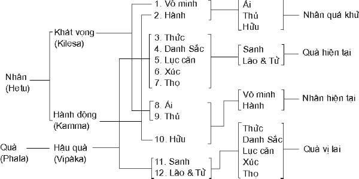

## Thập Nhị Nhân Duyên

> _"Không thể tìm ra một Tạo Hóa, một Brahma, hay một vị nào khác, làm chủ vòng luân chuyển của đời sống (Thập Nhị Nhân Duyên). Chỉ có những hiện tượng diễn tiến tùy duyên!"_
> - Thanh Tịnh Đạo

Tiến trình của hiện tượng tái sanh được Đức Phật giải thích đầy đủ trong Thập Nhị Nhân Duyên (Paticca Samuppada).

Paticca là "bởi vì" hay,"bởi", hay "tùy thuộc nơi". Samuppada là "phát sanh", hay "khởi đầu". Chiếu y theo ngữ nguyên, danh từ ấy là "phát sanh bởi vì", hay "phát sanh tùy thuộc", Paticca Samuppada áp dụng cho trọn công thức nhân quả gồm tất cả 12 nhân và quả liên quan với nhau, Phạn ngữ gọi là Paccaya và Paccayuppanna, nhân tạo duyên cho quả trổ sanh. Nên hiểu phương pháp tương quan của Paticca Samuppada (Thập Nhị Nhân Duyên) như sau:

> Bởi vì có A nên B phát sanh, bởi vì có B nên C phát sanh. Khi nào không có A tất nhiên không có B. Khi nào không có B thì C cũng không có. Nói cách khác, cái nầy như vầy thì có cái kia; cái nầy không phải như vầy thì cái kia không có (imasmim sati, idam hoti; imasmim asati, idam natthi hoti).

Thập Nhị Nhân Duyên[^1] là một bài pháp giảng về tiến trình của hiện tượng sanh-tử chớ không phải là một lý thuyết triết học về sự tiến hóa của vũ trụ. Giáo lý nầy chỉ đề cập đến vấn đề nguồn gốc của vòng sanh tử luân hồi, nguyên nhân của sự đau khổ, và chỉ nhằm mục đích giúp chúng sanh thoát ra khỏi mọi đau khổ của đời sống, chớ không tìm giải thích những bí ẩn liên quan đến nguồn gốc cùng tột của vũ trụ.

Pháp Thập Nhị Nhân Duyên chỉ giải thích "sự phát sanh của một trạng thái tùy thuộc nơi trạng thái trước kế đó".[^2]

Vô Minh (avijja) - tức không nhận thức chân lý về đau khổ, nguồn gốc của đau khổ, sự chấm dứt đau khổ, và con đường dẫn đến sự chấm dứt đau khổ - là nguyên nhân chánh làm động lực thúc đẩy, chuyển động bánh xe đời sống. Nói cách khác, Vô Minh là không nhận thức thực tướng của vạn pháp, hay không thấu đáo hiểu biết chân tướng của chính mình. Chính màng Vô Minh như lớp mây mù bao phủ, che lấp mọi sự hiểu biết chân chánh (Chánh Kiến).

Đức Phật dạy rằng:

"Vô Minh là lớp ảo kiến mịt mù dày đặc trong ấy chúng sanh quây quần quanh lộn."[^3] (Sutta Nikaya, câu 730).

Đến khi lớp Vô Minh bị phá tan để trở thành tri kiến, như trường hợp của chư Phật và chư vị A La Hán thì mọi vấn đề nhân và quả cũng chấm dứt.

Trong kinh Itivuttaka[^4], Đức Phật dạy:

"Người đã tiêu trừ ảo kiến và phá tan lớp tối tăm dầy đặc sẽ không còn thênh thang đi mãi nữa. Đối với người ấy không còn vấn đề nhân và quả."(Sutta Nikaya, trang 14)

Tùy thuộc nơi Vô Minh, Hành (samkhara) phát sanh. Phạn ngữ "samkhara" có rất nhiều ý nghĩa. Vì thế ta nên tùy trường hợp mà định nghĩa danh từ nầy. Ở đây samkhara là những tác ý (cetana) thiện (kusala), bất thiện (akusala), và không lay chuyển (anenja), tạo nghiệp (kamma) đưa đi Tái Sanh. Tác ý bất thiện nằm trong 12 loại tâm vương bất thiện. Tác ý thiện nằm trong 8 loại tâm đẹp (sobhana) và 5 loại tâm thiện trong thiền Sắc Giới (rupajhana). Tác ý không lay chuyển nằm trong bốn loại tâm thiện trong thiền Vô Sắc Giới (arupajhana).

Trong Ngũ uẩn, samkhara là danh từ gọi chung 50 trong 52 tâm sở. Hai tâm sở còn lại là Thọ và Tưởng.

Những tác ý (cetana) của bốn loại thánh đạo tâm (lokuttara maggacitta), hay tâm siêu thế, được coi như không phải là samkhara (hành), bởi vì những lọai tâm nầy hướng về sự tận diệt Vô Minh.

Trí tuệ (panna) là thành phần chánh yếu trong các loại thánh đạo tâm.

Trái lại, trong các loại tâm tại thế, yếu tố quan trọng là tác ý(cetana).

Tất cả những tư tưởng, lời nói và việc làm, thiện và bất thiện, đều được bao gồm trong Hành (samkhara). Những hành động tốt hay xấu - trực tiếp phát sanh từ Vô Minh hay bị Vô Minh gián tiếp làm động cơ thúc đẩy - đều nhất định phải tạo nghiệp, nghĩa là có tác động kéo dài thêm cuộc hành trình xa xôi của vòng luân hồi.

Ngược lại, những hành động (bằng thân, khẩu hay ý) hoàn toàn trong sạch, tuyệt đối không xuất phát từ tham, sân, si, nhất định phải thoát ra khỏi vòng phiền não của đời sống. Do đó Đức Phật so sánh Giáo Pháp của Ngài như một chiếc bè mà chúng sanh có thể nương theo để cố gắng vượt qua đại dương của cuộc sống. Những hành động của chư Phật và chư vị A La Hán không thể gọi là Hành (samkhara) vì các Ngài đã hoàn toàn tận diệt Vô Minh.

Vô Minh chiếm một phần quan trọng trong những hành động bất thiện và vẫn có tiềm tàng ngủ ngầm trong những hành động thiện. Như vậy cả hai hành động, thiện và bất thiện, đều được coi là bắt nguồn từ Vô Minh.

Tùy thuộc nơi Hành, tức hành động thiện và bất thiện trong kiếp vừa qua, "Thức-Tái-Sanh" (patisandhi vinnana), hay Thức-Nối-Liền, phát sanh trong kiếp kế. Gọi là Thức-Tái-Sanh hay Thức-Nối-Liền vì thức ấy nối liền kiếp quá khứ với kiếp hiện tại. Chính đây là thức đầu tiên trong một kiếp sống của chúng sanh. Trong trường hợp là người thì đó là thức đầu tiên của một chúng sanh khi bà mẹ thọ thai. Hiểu một cách chính xác, Thức, trong Thập Nhị Nhân Duyên là 19 loại Thức-Tái-Sanh được mô tả trong Vi Diệu Pháp (Abhidhamma). Tất cả ba mươi hai loại tâm quả (vipakacitta) kinh nghiệm trong kiếp sống vừa qua cũng được hàm xúc trong danh từ ấy.

Bào thai trong bụng mẹ được cấu tạo do sự phối hợp của thức-tái-sanh với tinh trùng và minh châu của cha mẹ. Trong thức ấy có ngủ ngầm tất cả những cảm giác đã thọ, những đặc tính và những khuynh hướng riêng biệt trong dòng đời đã qua của một cá nhân.

Thức-tái-sanh được coi là tinh khiết[^5] vì không bắt nguồn từ tham, sân, si[^6], cũng không xuất phát từ không-tham, không-sân, không-si[^7].

Danh-Sắc (nama-rupa) phát sanh cùng một lúc với thức-tái-sanh.

Hành và Thức (samkhara và vinnana) thuộc về hai kiếp, quá khứ và hiện tại, của một chúng sanh. Thức và Danh-Sắc trái lại, cùng phát sanh trong một kiếp sống.

Danh từ kép Danh-Sắc (nama-rupa) gồm hai hợp tổ: "Danh" (nama), phần vô hình, và "Sắc" (rupa), phần hữu hình, của một chúng sanh. Ta nên phân biệt Danh-Sắc trong trường hợp "Danh" riêng biệt và "Sắc" riêng biệt, và trường hợp "Danh-Sắc" hợp chung. Trong cảnh Vô Sắc Giới (arupa), chỉ có Danh mà không có Sắc. Trong cảnh giới Vô Tưởng Thiên (asanna), chỉ có Sắc mà không có Danh. Trong Dục Giới (kamma) và Sắc Giới (rupa), cả Danh và Sắc đồng phát sanh một lượt, cùng một lúc.

Danh ở đây là ba Uẩn: Thọ, Tưởng và Hành, cả ba cùng phát sanh một lượt với "thức-tái-sanh".

Sắc là ba lần "mười-thành-phần":

1. "mười-thành-phần" của thân,
2. "mười-thành-phần" của giống (nam nữ), và
3. "mười-thành-phần" của ý căn, cũng cùng khởi sanh một lượt với thức-tái-sanh, do nghiệp quá khứ tạo nên.

Mười thành phần của thân gồm có bốn nguyên tố gọi là Tứ Đại:

1. Nguyên tố có đặc tánh duỗi ra (pathavi), đất;
2. Nguyên tố có đặc tánh làm dính liền, hay kết hợp lại (apo), nước;
3. Nguyên tố có đặc tánh làm nóng (tejo), lửa;
4. Nguyên tố có đặc tánh là chuyển động (vajo), gió;

  _Và sáu chuyển hóa (upada rupa) của bốn nguyên tố ấy là:_

5. Màu sắc (vanna)
6. Mùi(gandha)
7. Vị (rasa)
8. Bản chất dinh dưỡng (oja)
9. Sinh khí (jivitindriya) và
10. Thân (kaya)

Mười-thành-phần của giống và mười-thành-phần của ý căn gồm 9 thành phần đầu (tức từ nguyên tố một đến nguyên tố 9), và thứ 10 là giống (nam hay nữ), hoặc ý căn (vatthu), tức căn cứ, hay nơi mà từ đó tâm phát sanh.

Như vậy ta thấy hiển nhiên rằng ngay từ lúc bà mẹ thọ thai, chúng sanh đã có nam tanh hay nữ tánh rồi. Và chính nghiệp quá khứ là nguyên nhân.

Phạn ngữ "kaya" ở đây có nghĩa là phần nhạy, khả năng "xúc" của thân (pasada).

Về giống (nam tánh hay nữ tánh), ngay lúc bà mẹ thọ thai, tuy chưa nở nang đầy đủ để hiển lộ ra hình thức, những khả năng trở thành nam hay nữ vẫn còn tiềm tàng. Cũng như ý căn, căn nguyên xuất phát ra ý, hay nơi trú ngụ, trụ sở của ý mà ta giả định là tim hay não, chưa hình thành lúc thọ thai. Tuy nhiên khả năng trở thành của ý căn vẫn còn tiềm tàng.

Về điểm nầy nên ghi nhận rằng Đức Phật không có chỉ rỏ nhất định phần nào trong thân là ý căn. Vào thời Ngài còn tại tiền, phần đông chủ trương, như kinh Upanishads, rằng tim là căn nguyên xuất phát ra ý. Trong kinh Patthana, Nhân Quả Tương Quan, khi đề cập đến căn ý, Đức Phật dùng những danh từ gián tiếp như "yam rupam nissaya - tùy thuộc nơi phần vật chất ấy", mà không chỉ rõ phần vật chất ấy có phải là tim hay não. Tuy nhiên những nhà chú giải, như Đức Buddhaghosa và Anurudha, quả quyết rằng ý căn là tim. Nên biết rằng Đức Phật không chấp nhận cũng không bác bỏ chủ trương phổ thông thời bấy giờ cho rằng ý căn là tim.

Trong thời ký thai ghén, Lục Căn (salayatana) của thai bào dần dần phát triển từ những hiện tượng tâm-vật-lý gồm tiềm lực vi tế vô tận trở thành guồng máy lục căn vô cùng phức tạp. Rất giản dị lúc ban sơ, guồng máy con người dần dần trở thành vô cùng phức tạp. Những máy móc thường thì trái lại, phức tạp lúc mới phát minh rồi dần dần trở nên giản dị, đến đổi lắm khi chỉ dùng sức của một ngón tay cũng đủ làm chuyểu động một bộ máy vĩ đại. Guồng máy lục căn của con người vận chuyển tự nhiên một cách tự động, gần như máy móc, không cần phải có một tác nhân nào tương tợ như một linh hồn để điều khiển. Mỗi căn (nhãn, nhĩ, tỷ, nhiệt, thân, ý) đều có những đối tượng và những sinh hoạt riêng biệt. Mỗi đối tượng của lục căn, tức lục trần-sắc, thinh, hương vị, xúc, pháp - tiếp xúc với mỗi căn liên hệ, làm phát sanh một loại "thức" . Như sắc tiếp xúc với nhãn làm phát sanh nhãn thức, thinh xúc với nhĩ làm phát sanh nhĩ thức v.v... Điểm giao hợp liên quan của ba yếu tố "căn" (giác quan), "trần" (đối tượng của giác quan), và "thức" là Xúc (phassa). Xúc hoàn toàn khách quan.

Đức Phật dạy:

"Vì có mắt (nhãn) và hình thể ( sắc) nên nhãn thức phát sanh, xúc là điểm giao hợp của ba yếu tố ấy. Vì có tai (nhĩ) và âm thanh (thinh) nên nhĩ thức phát sanh. Vì có mũi (tỷ) và mùi (hương ) nên tỷ thức phát sanh. Vì có lưỡi (thiệt) và vị (vị) nên thiệt thức phát sanh. Vì có thân (thân) và vật có thể sờ đụng (xúc) nên thân thức phát sanh. Vì có tâm (ý) và đối tượng của tâm (pháp) nên ý thức phát sanh. Điểm giao hợp của ba yếu tố ấy là Xúc (phassa).[^8]

Vậy nên hiểu rằng sự đụng chạm suông không phải là xúc (phassa), vì muốn có xúc (phassa) phải có đủ ba yếu tố: đối tượng, giác quan và thức (na sangatimatto eva phasso).

Tùy thuộc nơi Xúc, Thọ (vevada) phát sanh.

Một cách chính xác, chính Thọ cảm giác một đối tượng ấy tiếp xúc với giác quan. Chính Thọ thâu nhận quả lành hay quả dữ của những hành động trong hiện tại hay trong quá khứ. Ngoài tâm sở Thọ không có một linh hồn hay một bản ngã nào thọ hưởng quả lành hay gặt hái quả dữ.

Trong tất cả những loại tâm vương đều có tâm sở Thọ. Đại khái có ba loại Thọ là: thọ lạc (somanassa) hay cảm giác vui, hạnh phúc; thọ khổ (domanassa) hay cảm giác buồn, phiền não; và thọ vô ký (adukkhamasukha), không hạnh phúc cũng không phiền não. Hợp với cảm giác đau đớn (dukkha) và sung sướng (sukha) về vật chất, thì có tất cả năm loại cảm giác (thọ). Thọ vô ký, không vui sướng, hạnh phúc, cũng không đau khổ, phiền não, còn có tên là upekkha mà ta không nên lầm lẫn với tâm xả, hay trạng thái tâm bình thản.

Theo Vi Diệu Pháp (Abhidhamma), chỉ có cảm giác đau đớn trong một loại tâm vương, và chỉ có một cảm giác sung sướng trong một loại tâm vương khác. Hai loại tâm vương có liên quan đến cảm giác phiền não. Ngoài ra, trong tám mươi lăm loại tâm vương (89 - 4 = 85) còn lại, đều có cảm giác hạnh phúc hay vô ký.

Nên ghi nhận rằng Đạo Quả Niết Bàn là hạnh phúc không có liên quan gì đến Thọ (vedana). Đức Phật dạy rằng Đạo Quả Niết Bàn là hạnh phúc cao thượng nhất trong các hạnh phúc, nhưng đó không phải là trạng thái thọ hưởng những cảm giác sung sướng hay hạnh phúc.

Đạo Quả Niết Bàn là hạnh phúc giải thoát ra khỏi mọi hình thức đau khổ.

Tùy thuộc nơi Thọ, Ái phát sanh. Cũng như Vô Minh, Ái hay Dục (tanha) rất quan trọng. Luyến ái, khao khát, bám níu, là một vài danh từ thường dùng để phiên dịch Phạn ngữ "tanha".

Có ba loại ái dục là:

1. Ái Dục duyên theo nhục dục ngũ trần( kammatanha).
2. Ái Dục duyên theo những khoái lạc vật chất có liên quan đến chủ trương thường kiến (bhava tanha). Trong lúc thọ hưởng, nghĩ rằng vạn vật là trường tồn vĩnh cửu, và những khoái lạc nầy sẽ mãi mãi tồn tại.
3. Ái Dục duyên theo những khoái lạc vật chất có liên quan đến chủ trương đoạn kiến (vibhava tanha). Trong lúc thọ hưởng, nghĩ rằng tất cả đều tiêu diệt sau khi chết. Chết là hết.

Bhava-tanha có khi được giải thích là sự luyến ái đeo níu trong Sắc Giới, và Vibhava-tanha là sự luyến ái đeo níu trong Vô Sắc Giới. Hai Phạn ngữ ấy thường được dịch là ái dục đeo níu theo sự sống và ái dục đeo níu theo sự không-sống, không-sinh-tồn.[^9]

Có sáu loại ái dục liên quan đến lục trần (sắc, thinh, hương, vị, xúc, pháp). Nếu tính có sáu ái dục liên quan đến lục căn và sáu ái dục liên quan đến lục trần thì tất cả là mười hai. Nếu tính luôn ái dục trong quá khứ , hiện tại, và tương lai thì có tất cả 36\. Và nếu tính cả ba loại ái dục kể trên thí có 108.

Đối với người thường trong thế gian, loại aí dục đeo níu theo nhục dục ngũ trần phát triển một cách rất là tự nhiên. Chế ngự sự khao khát của lục căn thật khó khăn vô cùng. Hai yếu tố quan trọng và hùng mạnh nhất trong Thập Nhị Nhân Duyên là Vô Minh và Ái Dục, hai nguyên nhân chánh làm chuyển động bánh xe luân hồi. Vô Minh là nguyên nhân trong quá khứ, tạo điều kiện cho hiện tại, tạo điều kiện cho tương lai. Ái Dục là nguyên nhân trong hiện tại, tạo điều kiện cho tương lai.

Tùy thuộc nơi Ái, phát sanh Thủ (Upadana), cố bám lấy vật ham muốn. Thủ là Ái Dục tăng trưởng đến mức cao độ. Ái Dục như đi mò trong đêm tối để lấy trộm một vật. Thủ như chính sự trộm cắp. Nguyên nhân của Thủ là cả hai, luyến ái và lầm lạc. Do Thủ phát sanh ý thức sai lầm"Tôi" và "Của tôi".

Thủ có bốn: nhục dục, tà kiến, thân kiến và chủ trương sai lầm cho rằng có một linh hồn trường cửu.

Thân kiến và chủ trương lầm lạc về linh hồn trường cửu cũng được coi là tà kiến.

Tùy thuộc nơi Thủ, Hữu (Bhava) phát sanh. Theo căn nguyên của danh từ, bhava có nghĩa là "đang trở thành". Hữu (bhava) là cả hai, hành động tạo nghiệp (kammabhava) thiện và bất thiện (tiến trình tích cực của sự trở thành), và những cảnh giới của chúng sanh (tiến trình tiêu cực của sự trở thành). Có sự khác biệt tế nhị giữa Hành (samkhara) và Hữu (kammabhava). Hành là hành động trong quá khứ. Hữu là hành động trong hiện tại. Cả hai đều là hành động tạo nghiệp. hữu (kammabhava) tạo điều kiện cho sự tái sanh sắp đến.

Tùy thuộc nơi Hữu có sự Sanh (jati) trong kiếp kế. Một cách chính xác, Sanh là sự khởi phát của những hiện tượng tâm-vật-lý (khandanam patubhavo).

Lão và Tử (Jaramarana) là hậu quả hiển nhiên của Sanh.

Quả phát sanh vì có nhân. Vậy, nếu không có Nhân tức không có Quả. Nếu Nhân chấm dứt, tức nhiên Quả cũng chấm dứt.

Vấn đề được rỏ ràng hơn nếu ta suy nghiệm Thập Nhị Nhân Duyên theo chiều ngược như thế nầy:

Lão và Tử chỉ có thể hiện hữu trong một cơ thể tâm-vật-lý, tức trong một guồng máy lục căn. Một cơ thể tương tợ cần phải được "sanh" ra. Mà Sanh là hậu quả dĩ nhiên của nghiệp quá khứ (tức những hành động trong thời gian trước đó), phát sanh do Thủ và Ái tạo duyên. Ái chỉ phát sanh khi có Thọ, và Thọ là hậu quả của sự xúc chạm giữa Lục Căn và Lục Trần.

Như vậy, tức phải có Lục Căn. Mà không thể có Lục Căn nếu không có Danh-Sắc, tâm và cơ thể vật chất. Tâm phát sanh do Thức Tái-sanh tạo duyên. Thức Tái-sanh do sinh hoạt tâm linh trong quá khứ (Hành), và Hành bắt nguồn từ Vô Minh, nghĩa là không nhận thức được thực tướng của vạn hữu.

Toàn thể phương thức có thể tóm tắt như sau:

> Tùy thuộc nơi Vô Minh phát sanh Hành.  
> Tùy thuộc nơi Hành phát sanh Thức.  
> Tùy thuộc nơi Thức phát sanh Danh-Sắc  
> Tùy thuộc nơi Danh-Sắc phát sanh Lục Căn.  
> Tùy thuộc nơi Lục Căn phát sanh Xúc.  
> Tùy thuộc nơi Xúc phát sanh Thọ.  
> Tùy thuộc nơi Thọ phát sanh Ái.  
> Tùy thuộc nơi Ái phát sanh Thủ.  
> Tùy thuộc nơi Thủ phát sanh Hữu.  
> Tùy thuộc nơi Hữu có Sanh.  
> Tùy thuộc nơi Sanh có Lão, Tử, Sầu Muộn, Ta Thán, Đau Khổ, Buồn Rầu, và Thất Vọng.

Đó là trọn vẹn các yếu tố cấu thành đau khổ.

> Tận diệt Vô Minh dẫn đến chấm dứt Hành.  
> Chấm dứt Hành dẫn đến chấm dứt Thức.  
> Chấm dứt Thức dẫn đến chấm dứt Danh-Sắc.  
> Chấm dứt Danh-Sắc dẫn đến chấm dứt Lục Căn.  
> Chấm dứt Lục Căn dẫn đến chấm dứt Xúc.  
> Chấm dứt Xúc dẫn đến chấm dứt Thọ.  
> Chấm dứt Thọ dẫn đến chấm dứt Ái.  
> Chấm dứt Ái dẫn đến chấm dứt Thủ.  
> Chấm dứt Thủ dẫn đến chấm dứt Hữu.  
> Chấm dứt Hữu dẫn đến chấm dứt Sanh.  
> Chấm dứt Sanh dẫn đến chấm dứt Lão, Tử, Sầu Muộn, Ta Thán, Đau Khổ, Buồn Rầu, và Thất Vọng.

Đó là chấm dứt hậu quả của các yếu tố cấu thành Đau Khổ.

Hai yếu tố đầu tiên của Thập Nhị Nhân Duyên (Vô Minh, Hành) thuộc về quá khứ. Tám yếu tố giữa thuộc về hiện tại. Và hai yếu tố cuối cùng thuộc về vị lai.

Cả hai, Hành (samkhara), thiện và bất thiện, và Hữu (bhava), đều được xem là nghiệp (kamma). Vô Minh (avijja), Ái (tanha) và Thủ (upadana) là khát vọng hay ô nhiễm (kilesa). Thức, Danh-Sắc, Lục Căn, Xúc, Thọ, Sanh, Lão, Tử đều là quả (vipaka).

Như vậy Vô Minh, Hành, Ái,Thủ và Hữu là năm nguyên nhân trong quá khứ tạo duyên (điều kiện) cho năm quả trong hiện tại là Thức, Danh-Sắc, Lục Căn, Xúc và Thọ phát sanh. Cùng thế ấy Ái, Thủ, Hữu, Vô Minh và Hạnh trong hiện tại tạo duyên cho năm quả kế trên phát sanh trong tương lai.

Tiến trình Nhân và Quả liên tục diễn tiến vô cùng tận. Không thể nhận ra khởi điểm của tiến trình ấy vì ta không quan niệm được lúc nào trong dòng thời gian vô tận, luồng sống của ta không bị màng Vô Minh bao phủ. Tuy nhiên, giờ phút nào mà trí tuệ thay thế Vô Minh và luồng sống chứng nghiệm được bản chất của Niết Bàn (Nibbana dhatu) thì, chỉ đến chừng ấy, tiến trình sanh tử mới chấm dứt.

_"Chính Vô Minh dẫn dắt ta đi vòng quanh ảm đạm  
Rầy đây mai đó của chuỗi dài sanh-tử, tử-sanh vô cùng tận."_[^10]

_**Chú thích:**_

[^1]: Pháp Thập Nhị Nhân Duyên cũng được gọi là Thập Nhị Nhân Duyên Khởi hay Tùy Thuộc Phát Sanh .

[^2]: Tabbhavabhavibhavakaramatta - Abhidhammattha Sangaha. Xem "A Manual of Abhidhamma" của tác giả Narada Thera, trang 360.

[^3]: Sutta Nikaya, câu 730.

[^4]: Suuta Nipatta, trang 14.

[^5]: "Thức nầy là tinh khiết", pabhassaram idam cittam, Đức Phật dạy như vậy trong Anguttara Nikaya, Tăng Nhứt A Hàm, tập 1, trang 10\. Theo chú giải, Đức Phật nói vậy khi đề cập đến thức-tái-sanh.

[^6]: Trong trường hợp "Quả Vô Nhân" (Ahetuka vipaka).

[^7]: Trong trường hợp "Quả Vô Nhân"(Sahetuka vipaka).

[^8]: Samyutta Nikaya, Tạp A Hàm, phần ii, trang 70\. Kindred Sayings, phần ii, trang 50.

[^9]: Xem Chương 6.

[^10]: Chalmers, "Buddha's Teachings", câu 729-730.
