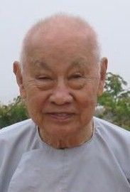

## Vài nét về Cư sĩ Phạm Kim Khánh

 **_Bình Anson_**

Cư sĩ Sunanda Phạm Kim Khánh sanh ngày 10 tháng 1 năm 1921 tại Bến Tre, trong một gia đình vọng tộc lâu đời ở Bà Rịa. Ông Nội là Hương cả, văn hay chữ đẹp. Thân phụ ông là Đốc phủ sứ Phạm Kim Chi, thân mẫu là cụ bà Lâm Thị Tỵ. Cư sĩ Phạm Kim Khánh là người con thứ 7 trong gia đình có 5 trai 3 gái. Cư sĩ mồ côi mẹ khi ông mới được 4 tuổi. Ở tuổi 45 đầy quyền thế nhưng không tục huyền, cụ ông dành trọn thì giờ rảnh rang lo giáo huấn con cái rất nghiêm, và tham gia các công việc bảo tồn văn hóa học thuật nước nhà. Khi tùng sự tại Hà Tịnh, cụ ông có duyên được người cháu ba đời của văn hào Nguyễn Du là tiến sĩ Nguyễn Mai tặng cho bản sao quyển Kim Túy Tình Từ. Cụ dày công nghiên cứu, phiên chú và xuất bản năm 1917 (về sau, được Phủ Quốc Vụ Khanh Đặc Trách Văn Hóa tái bản năm 1972 tại Sài Gòn).

_Cư sĩ Phạm Kim Khánh, tại khoá thiền tháng 6-2004, Thích Ca Thiền Viện, California_

Cư sĩ Phạm Kim Khánh từng học qua các trường tiểu học ở Mỏ Cày, trung học Chasseloup Laubat ở Sài Gòn, và trường Providence ở Huế, tới cấp bậc Tú tài. Ông tinh thông không những Pháp văn mà cả Anh văn và có nhiều hiểu biết về những danh từ Pàli. Cái học của ông là cái học của hàng học giả, tự nghiên cứu, tìm tòi, bồi đấp lấy, thâm hậu và vững vàng. Mặc dù chịu nhiều ảnh hưởng Thiên chúa giáo, ông cũng biết đến đạo Phật qua tạp chí Niết Bàn của hội Thông Thiên Học và tạp chí Từ Bi Âm của hội Nam Kỳ Nghiên Cứu Phật Học, do cụ thân sinh mua dài hạn cho đọc.

Vào thời thanh niên, trong những năm 1948-1955, ông làm Trưởng phòng Phim-ảnh (ciné-photo) tại Cao Ủy Phủ Xứ Cam Bốt (Haut Commissariat du Cambodge). Nhờ thế ông có nhiều dịp -- gần như hằng đêm -- cho chuyên viên đem xe phát điện và chiếu bóng đến các sân chùa, chiếu phim cho công chúng xem. Ông từng gặp và có cảm tình với chư Tăng Nam tông vì các ngài hiền lành; nhưng vì còn có nhiều định kiến về tinh thần phục vụ xã hội nên lúc ban đầu, ông không thích Phật giáo. Ông thường thắc mắc tại sao các vị sư không sản xuất mà lại đi khất thực, chỉ có tiêu thụ mà không thấy sản xuất, đóng góp cho xã hội.

Về sau, ông mới biết rằng Phật giáo gồm bốn hạng gọi là tứ chúng. Hàng xuất gia gồm tỳ khưu và tỳ khưu ni, và hàng cư sĩ là thiện nam và tín nữ. Hàng cư sĩ có phận sự cung cấp phần vật chất cho hàng xuất gia. Ngược lại, hàng xuất gia cung cấp về phần tinh thần đến hàng tại gia cư sĩ. Ông chưa có duyên đi vào đạo mặc dầu nhạc phụ (Đốc phủ sứ Lê Thành Long, từng là phó Hội trưởng Hội Thông Thiên Học) từng giảng đạo Phật cho ông nghe, như về Tứ Diệu Đế, Thập Nhị Nhân Duyên, v.v. Ông chỉ vâng vâng dạ dạ cho vui lòng nhạc phụ, chứ không chú ý lắm.

Năm 1959, cư sĩ được nhạc phụ cho biết thị xã Bà Rịa sẽ có tổ chức tiếp đón Đại đức Nàrada Mahà Thera từ Tích Lan sang hoằng pháp. Sau đó, cả gia đình bên vợ đều quy y với Ngài Nàrada, ngoại trừ cư sĩ. Tuy nhiên, về sau, khi nghe trọn 12 thời pháp tại chùa Kỳ Viên, Quận 3, Sài Gòn, ông hiểu được và thấm thía, nên tháng 9 năm đó, cư sĩ Phạm Kim Khánh xin quy y Tam Bảo và được Ngài Nàrada ban pháp danh là Sunanda (Thiện Duyên).

Từ khi quy y Tam Bảo, cư sĩ dành trọn thì giờ học hỏi giáo lý, có khi bỏ cả giờ ăn trưa, nghĩ trưa, để đến chùa Kỳ Viên tham vấn Ngài Nàrada. Khoảng đời bận rộn nhất là những năm dài làm chủ biên cùng lúc cho chín tờ đặc san tại Sài Gòn, như Thế Giới Tự Do, Hương Quê, v.v. nhưng ông vẫn nỗ lực kiên trì sáng tác và dịch thuật nhiều tác phẩm Phật giáo nổi tiếng.

Nổi tiếng nhất có lẽ là quyển "**Đức Phật và Phật Pháp**" (The Buddha and His Teachings, nguyên tác Anh ngữ của Ngài Nàrada), được xuất bản tại Sài Gòn bằng hai thứ tiếng Anh và Việt. Bản Việt ngữ do cư sĩ Phạm Kim Khánh chuyển dịch, với 4.000 quyển đầu tiên được in ra vào năm 1970, và sau đó một năm, được tái bản thêm 4.000 quyển. Từ đó đến nay, quyển này đã được in lại rất nhiều lần, trong nước cũng như tại hải ngoại, và được xem như là một trong những tài liệu căn bản quan trọng trong các khóa Phật học. Năm 1998, cư sĩ đã hiệu đính lại bản dịch đó, dựa theo ấn bản Anh ngữ cuối cùng của Đại đức Nàrada, trước khi Ngài viên tịch.

Cư sĩ Phạm Kim Khánh là người có công lớn trong ban xây dựng và quản trị Thích Ca Phật Đài ở Vũng Tàu với nhiệm vụ Tổng Thơ Ký Ban Quản Trị. Ông cũng là Tổng Thơ Ký Tổng Hội Phật Giáo Nguyên Thủy Việt Nam cho đến năm 1975.

Từ khi sang định cư tại Hoa Kỳ, ông tiếp tục các công tác hoằng pháp, đóng góp nhiều Phật sự. Ông là một trong 12 vị cư sĩ đầu tiên đứng ra thành lập chùa Cổ Lâm tại Seattle, Hoa Kỳ. Đặc biệt nhất, ông thành lập Trung Tâm Nàrada vào tháng 9 năm 1987, để ấn tống và phát hành băng và sách Phật giáo. Trung tâm hoạt động đều đặn, tháng trước cuộn băng, tháng sau quyển sách, cho đến tháng 9 năm 1997 thì ngưng vì bà phối ngẫu, cộng tác viên trung thành của ông, trở bệnh nặng.

Hiện nay, tuy tuổi đời chồng chất, trông ông không hề mỏi mệt với sở nguyện hộ trì và hoằng dương chánh pháp. Tánh hài hước u mặc nhạy bén vẫn cứ như xưa. Mỗi tháng ông tổ chức họp mặt các đạo hữu để cùng nhau hành thiền, trao đổi kinh nghiệm, học hỏi giáo pháp. Mỗi ngày, ngoài giờ hành thiền, ông vẫn đều đặn dịch thuật và trước tác. Ông có nguyện vọng thực hiện một cuốn sách với nhiều hình ảnh về Phật Giáo Miến Điện, tương tự như cuốn Hành Hương Xứ Phật.

Được hỏi về tương lai Phật Giáo cho người Việt Nam hải ngoại, ông mong mỏi được thấy hai phần -- vật chất như chùa chiền, và tinh thần như giáo pháp -- phải được quân bình. Giới trẻ chịu ảnh hưởng tân học hầu như thích nghe giáo pháp, muốn biết Đức Phật là ai và Đức Phật dạy những gì, hơn là chỉ tụng kinh tu phước như những người có tuổi. Phật Pháp rất thích hợp với khoa học nên ông mong rằng người Phật tử cần được nghe giáo pháp nhiều hơn nữa. Ở các nước Tây Phương, phần lớn người theo Phật giáo là hạng trí thức; họ tìm hiểu và chỉ chấp nhận khi đã hiểu. Trong Phật giáo không có đức tin mù quáng. Người Phật tử không bị bắt buộc phải tin điều gì nếu mình không hiểu như thế.

Sau đây là những gì ông đã thực hiện được:

#### A. Sáng Tác 

1. Đóng góp phần lớn hình ảnh cho hai quyển: a) Indochine Profonde -- Illustrations photographiques. J.P. Dannaud, do Cao ủy Phủ Đông Dương xuất bản năm 1954; và b) Cambodge. J.P. Dannaud, Société Asiatique d'Éditions, Saigon, 1959.
2. Phật Giáo, Một Sự Nghiệp Tinh Thần Của Người Việt Nam. Phỏng viết theo một thời Pháp của Ngài Nàrada, 1961
3. Tứ Diệu Đế. Phỏng viết theo những thời Pháp của Ngài Nàrada, 1964.
4. Thánh Tích Thích Ca Phật Đài. 1972
5. Ba Pháp Tu Học Của Người Cư Sĩ. 1987
6. Lịch Sử Truyền Bá Phật Giáo Nguyên Thủy Tại Việt Nam (viết chung với Bác Sĩ Nguyễn Tối Thiện). 1990
7. Nàrada Mahà Thera. 1992
8. Tam Quy Ngũ Giới. 1992
9. Con Đường Cũ Xa Xưa. 1993
10. Ba Đặc Tướng Của Đời Sống (viết trong thập niên 1990)
11. Ngụ Ngôn Và Tích Chuyện Trong Phật Giáo. 1996
12. Hành Hương Xứ Phật. 1997
13. Nhiều bài nghị luận đăng trong Tạp chí Đường Sáng, Chùa Cổ Lâm, Hoa Kỳ, và những bài viết ngắn rải rác đó đây.

#### B. Dịch Thuật 

1. Hạnh Phúc Gia Đình. Tác giả: Nàrada Mahà Thera. In lần thứ nhất tại Việt Nam, 1962. Tái bản nhiều lần tại Việt Nam, Pháp và Hoa kỳ.
2. Sống Trong Hiện Tại. Tác giả: Ananda Pereira. 1963. In lần thứ nhất tại Việt Nam và tái bản tại Hoa Kỳ.
3. Phần Giản Dị Trong Phật Giáo. Tác giả: Kassapa Thera. 1964. Tái bản tại Hoa Kỳ (1992).
4. Lý Nhân Quả. Tác giả: Nàrada Mahà Thera. 1965.
5. Thoát Đến Thực Tế. Tác giả: Ananda Pereira. 1967. Tái bản tại Hoa Kỳ (1991).
6. Suy Niệm Về Hiện Tượng Chết. Tác giả: V.F. Gunaratna. In tại Việt Nam (trong thập niên 1960). Tái bản tại Hoa Kỳ (1997).
7. Nhẹ Gánh Lo Âu. Tác giả: Sri Dhammananda. 1968. Tái bản nhiều lần tại Hoa Kỳ.
8. Phật Giáo Vấn Đáp. Tác giả: Francis Story. 1969.
9. Đức Phật Và Phật Pháp. Tác giả: Nàrada Mahà Thera. In tại Việt Nam, 1970. Tái bản nhiều lần tại Việt Nam, Pháp, và Hoa Kỳ.
10. Kinh Pháp Cú. Tác giả: Nàrada Mahà Thera. 1971. Tái bản tại Hoa Kỳ.
11. Vòng Luân Hồi. Tác giả: Tỳ Khưu Khantipalo, 1971. Tái bản tại Hoa Kỳ (1994).
12. Thập Nhị Nhân Duyên. Tác giả: Piyadassi Mahà Thera. 1972.
13. Một Buổi Thuyết Trình Về Tứ Diệu Đế. Tác Giả: V.F. Gunaratna. 1973
14. Thực Hành Thiền Định. Tác giả: Phra Acharn Plien Panyapatipo. 1991
15. Giác Minh. Tác giả: Ngài Acharn Chah. 1992.
16. Hương Vị Giải Thoát. Tác giả: Ngài Acharn Chah (dịch trong đầu thập niên 1990).
17. Tự Quán Chiếu. Tác giả: Tan Achahn Kor Khao Suan Luan. 1992
18. Tiếng Vọng Từ Chân Tâm. Tác giả: Acharn Mahà Boowa.1992
19. Bài Học Nhân Một Đám Táng. Tác giả: Phra Acharn Mahà Boowa. 1994
20. Khéo Vấn Khéo Đáp. Tác Giả: Đ.Đ. Shavasti Dhammika. 1994
21. Phật Giáo, Nhìn Toàn Diện. Tác giả: Piyadassi Mahà Thera. 1995
22. Niệm Và Người Hành Thiền. Tác giả: Thiền Sư U. Pandita. 1995
23. Lợi ích Của Thiền Tập. Tác giả: Thiền Sư Acharn Tong. 1996
24. Bảy Giai Đoạn Thanh Lọc Và Tuệ Minh Sát. Tác giả: Matari Sri Nànàràma Mahà Thera. 1996
25. Thiền Minh Sát. Tác giả: Mahasi Sayadaw. 1997
26. Vi Diệu Pháp Toát Yếu. Tác giả: Nàrada Mahà Thera. 1999
27. Chín Yếu Tố Chánh Giúp Tăng Cường Ngũ Căn Của người Hành Thiền Minh Sát. Tác giả: U. Kundala Sayadaw. 1999
28. Bốn Điều Không Thể Ngăn Ngừa. Tác giả: U. Kundala Sayadaw. 2000
29. Đời Sống Quả Thật Bấp Bênh, Vô Định - Cái Chết Sẽ Đến, Chắc Như Thế. Tác giả: Sri Dhammananda. 2001
29. Kinh Vô Ngã Tướng. Tác giả: Mahasi Sayadaw. 2001
30. Ca Khúc Hoan Hỷ Giải Thoát Ra Khỏi Ngũ Uẩn. Tác giả: Acharn Mun Bhuridatto. 2001
31. Ba mươi bảy Phẩm Trợ Đạo. Tác giả: Ledi Sayadaw. 2002

#### C. Băng ghi âm 

1. Nguyên bộ lớn như: Đức Phật và Phật Pháp, Giác Minh, Hương Vị Giải Thoát, Tam Quy Ngũ Giới, Tự Quán Chiếu.
2. Khoảng 50 bộ nhỏ.

_**Bình Anson ghi chép,
Perth, Western Australia
Tháng 2-2003** (viết theo tài liệu của Nhóm Đạo Hữu Trung Tâm Nàrada, Hoa Kỳ)_ 